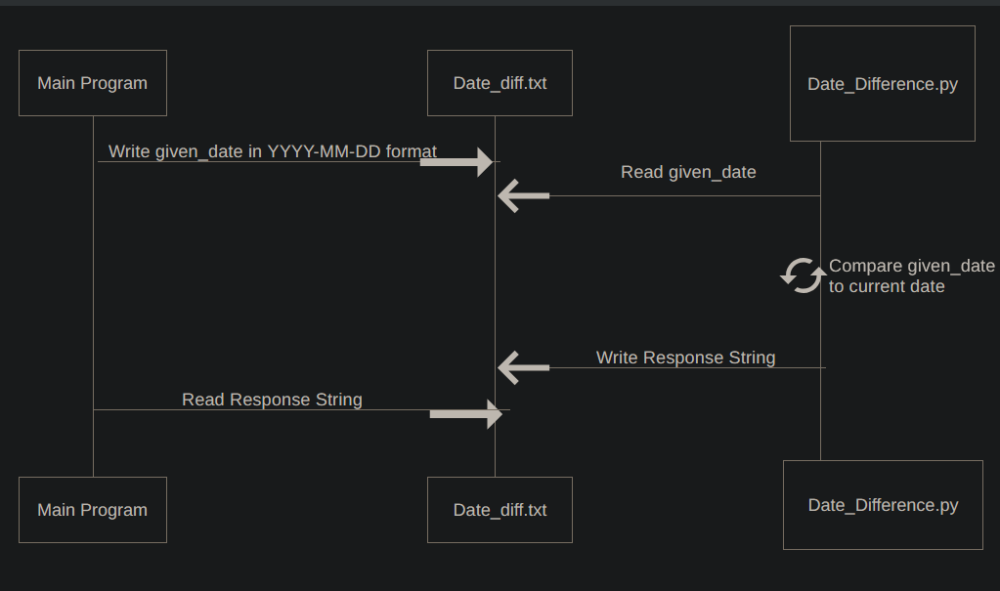

# Date Difference Microservice

## Description

The Date Difference Microservice calculates the number of days between today's date and a given date.

It can return whether a date is:

- Coming up in the future
- Already overdue
- Due today
- Invalid because it was entered in the wrong format

This microservice uses a text file called `date_diff.txt` for communication.

---

## How to Request Data

To request data, another program writes a date into `date_diff.txt`.

The date must use this format:

```text
YYYY-MM-DD
```

An example request should be in this format:

```text
2026-08-03
```

Example request code:

```python
with open('date_diff.txt', 'w') as file:
    file.write('2026-08-03')
```

---

## How to Receive Data

After the request is written, the microservice reads the date from `date_diff.txt`, calculates the result, and writes the response back into the same file.

The requesting program can then read `date_diff.txt` to receive the result.

Example receive code:

```python
with open('date_diff.txt', 'r') as file:
    response = file.read().strip()

print(response)
```

Possible responses:

```text
DAYS_REMAINING: 3
```

```text
OVERDUE: 2403
```

```text
DUE_TODAY: 0
```

```text
DATE_DIFF_ERROR: Invalid date format. Use YYYY-MM-DD.
```

---

## Example Full Request/Receive Function

```python
import time

def request_date_difference(given_date):
    with open('date_diff.txt', 'w') as file:
        file.write(given_date)

    while True:
        with open('date_diff.txt', 'r') as file:
            response = file.read().strip()

        if response.startswith('DAYS_REMAINING: '):
            return response
        elif response.startswith('OVERDUE: '):
            return response
        elif response.startswith('DUE_TODAY: '):
            return response
        elif response.startswith('DATE_DIFF_ERROR: '):
            return response

        time.sleep(0.5)
```

Example usage:

```python
result = request_date_difference('2026-08-03')
print(result)
```

---

## UML Sequence Diagram





---

## How to Run

Open two terminals.

In first terminal start Date_Difference.py:

```bash
python Date_Difference.py
```

In second terminal run the test program:

```bash
python DD_Test_Program.py
```

The test program will send example dates to Date_Difference.py and print the response.

---

## Example Test Output

```text
Date Difference Test Program
============================
Request sent: 2026-08-03
Response received: DAYS_REMAINING: 3

Request sent: 2020-01-01
Response received: OVERDUE: 2403

Request sent: bad-date
Response received: DATE_DIFF_ERROR: Invalid date format. Use YYYY-MM-DD.
```